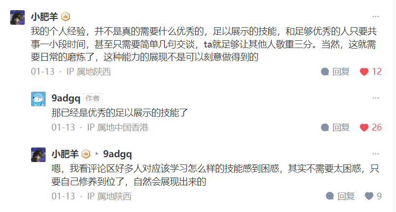
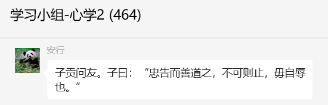
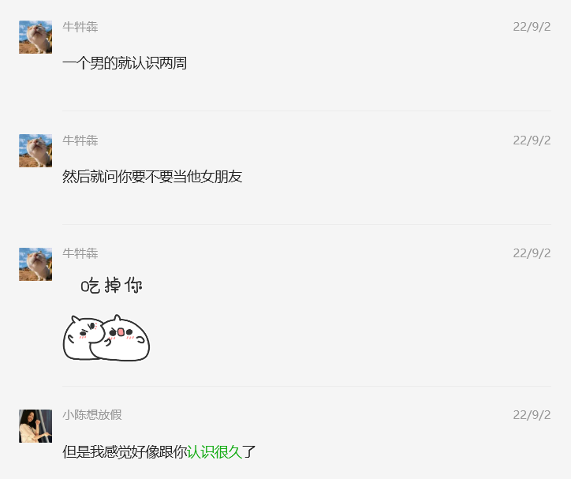

## 
文摘

#闷鼓#

这么说吧，一般被人毫不留情的严厉批评的人，都有一关没过——就是**没有什么事情做得漂亮到神乎其技，令人肃然起敬。**

一件都没有。

因为遇到了抬手就下重锤的人实属正常，那是你**荒废了二十年时间都没练出任何一样人不能不服的硬功夫**的正常结果。

[没做好事情，张嘴就说你不对，下意识排斥接下来的话，暴躁和郁闷，说都是自己的问题，要怎么疏导这种心理? - 9adgq的回答 - 知乎](https://www.zhihu.com/question/639212137/answer/3360367662)

---

#偶像崇拜# #闷鼓# #卑微#

陷入偶像崇拜的当事人内心是自觉卑微甚至卑贱的。

[怎么对清北同龄人心理上祛魅？ - 柯南歆xin的回答 - 知乎](https://www.zhihu.com/question/642126644/answer/3458480683)

---

#奴性# #安全感#

奴性，其实背后是对于安全感的渴求。

[人的奴性到底是怎么回事呀？是天生的吗？ - 林先生的回答 - 知乎](https://www.zhihu.com/question/417176353/answer/3129246149)

---

#多巴胺#

如果，你每天都这么快乐。那还管什么人生的意义

[人生活拼命努力究竟是为了什么？ - fatebyme的回答 - 知乎](https://www.zhihu.com/question/481059999/answer/2090667666)

---
#梵高#

每个人的心里都有一团火，路过的人只看到烟

[每个人心中都有一团火 路过的人只看到烟 真的是梵高写的吗 原版是啥？ - 墨契的回答 - 知乎](https://www.zhihu.com/question/36567596/answer/79548011)

---

#忠告#

[忠告而善道之，不可则止，毋自辱焉。](https://so.gushiwen.cn/mingju/juv_378cfe450efe.aspx)

对待朋友要忠言相告，引导他向善。如果不听从就罢了，不要自取其辱。

---

你是否有过这样一种感觉?一个素昧平生的人，只是第一眼见到就觉得对他很有「感觉」，之前从未通过其他方式对他有所了解，还没来得及和他有任何的互动，就莫名会被他吸引。

**只是因为，他正好契合了你潜意识深处的某种「熟悉的感觉」。**

**那些让你感觉遇到爱的人，就是一种让你回到当年熟悉味道的心锚。**

**人们对于熟悉的环境会有一种莫名的安全感，哪怕这种熟悉是痛苦的。**

所以，因为需求而结合的亲密关系怎么会幸福呢？**当你带着需求去寻找对象时，实际上就是一种索取，这跟「爱」刚好是背道而驰的。**

什么是爱？爱是内心充满后的溢出，是你很想为某人付出一切的那种感觉。

什么是爱？爱是内心充满后的溢出，是你很想为某人付出一切的那种感觉。

爱，是以种无条件化付来，是以能的心灵富足之后化表现。

如果你发现自己的亲密关系就是当年错把需求当成爱的结果，那怎么办？分手吗？离婚吗？这真的是解决一切问题的办法吗？

当然不是！

#### 不幸的婚姻之所以不幸，其根本原因就是错把需求当成爱！

[为什么有的人谈恋爱超不过一个星期就想分手？ - 盐选心理的回答 - 知乎](https://www.zhihu.com/question/456733524/answer/3382624041)