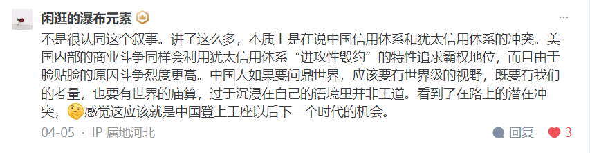

## 
文摘

#叙事#

[华为 叙事](https://www.zhihu.com/pin/1759456334490357760)

---

#原生家庭#

**家庭的生态位相当于恐怖游戏里的安全屋。在安全屋外，我可以接受自己被怪物追杀、被辱骂、被欺骗、被伤害，我不是不恨，而是没必要抱怨这些事**——毕竟这是个恐怖游戏，如果我火药充足，我迟早把这群怪物全都突突了，我的恐惧完全来源于我的火力不足。但是我回到安全屋，你还给我来什么解密小游戏，例如搞定这个华容道才能去睡觉，那我直接退出游戏开始写差评小作文。

[为什么人总会在「生活不顺」的时候，想起原生家庭带来的痛？ - 柯烟的回答 - 知乎](https://www.zhihu.com/question/649164828/answer/3445713117)

---

#道歉#

因为历史已经永恒，那么只要你的价值观没变，作为价值观对事实的观照结果的道歉立场就无可改变。立场没变，作为立场的声明——道歉——就永久有效。

何时你说“够了”，何时**你之前的道歉就全部作废**。

[为什么同是战败国，日本死不道歉，德国却反省得如此彻底？ - 9adgq的回答 - 知乎](https://www.zhihu.com/question/68120611/answer/3009802792)

---

#理由# #乡愿# 

中国流传一个恶习，就是喜欢无关的深入询问理由，然后根据理由去决定要不要“网开一面”。

不要问。了解到没有交，就打住，进入依约处理环节。不要让事情发展到“问清楚了理由，然后决定要不要原谅”这一步。不要让人养成“不交东西交理由”的恶习。养成了这个人就废了。

[老师常说的“没带就是没写”合理吗？ - 9adgq的回答 - 知乎](https://www.zhihu.com/question/457033055/answer/1877436685)

---

#传说# #功夫# #知识#

**不是以己之有余奉人之不足，而是求人之有余以奉己之不足。**

因为**写在这里的只是知识**。

知识不是技能，**知识只不过是一种虚无的传言**。

只有技能，才是真正与这个物理的世界交往的真实的语言。而颠扑不破、雷打
不动、举重若轻、大巧若拙的的技能——也就是功夫，才是你真正拿到手的东
西、属于你的东西，是砌成你真正的自我大厦的砖块。

很多人自认为“知道”无数的“知识”，就已经自我成型了，其实ta们不过是耳闻了无数的传说，就自以为是英雄了而已。

[为什么当我很爱一个人的时候会觉得很痛苦？ - 9adgq的回答 - 知乎](https://www.zhihu.com/question/418006057/answer/1827778336)

