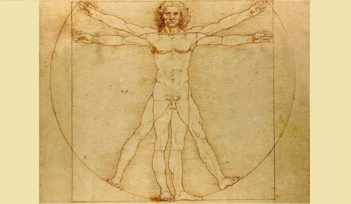

## 
文摘

#达芬奇#

[历史上有哪些智商逆天的天才？ - 阿星派驻地球卧底的回答 - 知乎](https://www.zhihu.com/question/23228706/answer/3469803588)

---

#最好的时光# #黄金时代#

“最好的时光是哪一段并无太大意义，因为所有的时光都是被辜负被浪费的，也只有在辜负浪费之后，才能从记忆里将某一段拎出，拍拍上面沉积的灰尘，感叹它是最好的时光。”

这是侯孝贤的《最好的时光》

[最好的时光或黄金时代](https://foxflower.lofter.com/post/2717d7_2b3ed15e1)

---

#真善美#

愿你人生的高光时刻，充满真善美！

[真善美](https://foxflower.lofter.com/post/2717d7_2b402a0a6)

---

#美国和中国#

他们无法在同一个社会下，共同发展。所以，一个呆在美国，一个回到中国。

[美国和中国](https://foxflower.lofter.com/post/2717d7_1cd29ca52)

---

#二十五岁#

25岁，可以分享生活，但是不能指点生活啊。要知道25岁的人生，其实什么都不懂，什么都没有。

[二十五岁](https://foxflower.lofter.com/post/2717d7_1cd1261b0)

---

#固执# #小我#

**你越是认同这个小我，就越是自我设限。**

**星座，到塔罗牌，到mbti，再到现在的淡人浓人，之所以能火，就是因为通过一种形象塑造的方式给人定性，让那些没有自我认同感的人获得虚假的自我，找到身份认同感。**

[为什么有时候人会很固执？ - 李雾月的回答 - 知乎](https://www.zhihu.com/question/652853214/answer/3469656838)

---

#学习# #方法论#

很遗憾，大部分人，可能一辈子都不懂什么叫方法。埋头苦干、重复当然有一定意义。但太局限，不容易进一步在深度、广度上发展。

[你会运动吗？你会读书吗？你的方法论在哪里？](https://foxflower.lofter.com/post/2717d7_1ccbd9bae)

---

#萨特# #儒家# #自我价值#

当年萨特被授予诺奖，他拒绝。这当然可以有很多解读。但从纯然珍视自己作品超然（超过）世间名誉，或者说直接点的人话，世间名誉配不上我的作品，这在中国最多算个狂狷。

东方的特点，所有的一切皆归于江山社稷，以及它所附带的种种。在那里，没有超越，没有自我的超越，也没有体系的超越。当然更不允许超越。

[功名利禄](https://foxflower.lofter.com/post/2717d7_1cc57a9a0)

---

#超越自我#

人生肯定是非常有限的，不要把人生浪费在那些低价值甚至无价值的人和事上面。

人要的是沉着冷静，一步步的去实现理想，完成目标。没有创造力火花的时候，就去打基础。有创造力源泉的时候，就去尽兴工作。

没必要去完成所谓面面俱到的完美，所谓道德上的优越。对人对物，基本尊重，法律之内，就够了。

去成为一个高尚的你，去成为一个高贵的你。**不是削脸、化妆、故作姿态，而是汗水、沉着、奋斗不息。**

[超越自我](https://foxflower.lofter.com/post/2717d7_1cb995c43)

---

#不要惩罚你自己#

最好不要把自己放到这种左右为难的处境里。真的。不要惩罚你自己。

在你选择做那些事情之前，这是别人犯下来的错，但是在那之后……我们这个社会饿不死人的，你什么都不做就那么瘫下去也不会饿死的，你真的真的没有必要去主动惩罚你自己。

[一个女人和很多男人睡过，是不是很脏了? - 加纳班图尔的回答 - 知乎](https://www.zhihu.com/question/644196601/answer/3471883363)

---

#情绪价值#

“情绪价值（Emotional Value）”这个词汇的原始含义，也根本不是用来形容人给人提供的价值的。

现在可倒好，不知道是哪个大聪明硬生生的给它整成了形容人际之间的价值交换，还能火成这样。

难道不觉得，连情绪都能这样计算价值，也活得也太功利了吗？

你为谁哭，为谁笑，你爱谁，你恨谁，这全是你最主观的情感，本来就应该是自然恣意而发。

**对任何一个个体而言，生命都是无价的，就像有钱难买你乐意。**

现在，你要把这些都折现了，你跟人的情感交流都要算账了，你说，这情绪价值，该不该讨人厌吧！

#Comment

为什么你讨厌情绪价值这个词？  
领导与员工之间需要情绪价值  
夫妻之间需要情绪价值  
与顾客之间需要情绪价值  
听得多了，谁来给我情绪价值  
情绪价值原本是相互的  
比如夫妻，恋人之间  
但是光给别人情绪价值了  
我们的情绪价值哪里来  
去消费，去KTV，去酒吧，去足浴…  
如果没时间去，不去的呢  
所以这个情绪价值让人厌恶  
一个人长时间的输出  
总要充电的时候  
当没电的时候  
自身的情绪价值都给了别人  
所以这种莫名的讨厌  

如果情绪可以量化，那么，亲情，爱情，友情是不是也可以量化？喜怒哀乐是不是也可以量化？用统一的标准衡量五花八门的需求，会加重情绪焦虑问题。情感是个私人订制的高级玩意，量产就low了。

将情感或者情绪价值化是对人的进一步物化，当然会不舒服了。

[为什么我特别讨厌情绪价值这个词? - 解磊的回答 - 知乎](https://www.zhihu.com/question/653121998/answer/3469711156)

---

不知道谁发明的这个概念，情绪价值，我其实也不care。

我们成年人，更应该做的是情绪管理，而不是什么提供情绪价值。

一般爱说情绪价值的女人，潜台词都是：

**我要仪式的浪漫，我寂寞时你要陪伴，我无聊时你要陪我聊天，我不高兴时你要哄我，我想买东西的时候你要付账单，我撒娇的时候你要配合，我发脾气的时候你要忍耐，我打你的时候你不要还手，我不会做饭你要做饭，我不想吃的时候你要喂我，我情绪不高的时候你要安慰我，节日的时候你要送我礼物，你要永远的宠我、爱我，纵容我，我错了也是对的，我对了更是对的。你要赞美我，夸我，时不时的亲亲我，抱抱我，有事没事都要想我......**

**佛家早就总结了几个字：贪、嗔、痴、慢、疑，是谓五毒。**

**所谓情绪，不就是“嗔”嘛。**

烦不烦嘛，长不大的巨婴，行走的荷尔蒙，直立的情绪罐子......

发脾气不是本事，遇事不发脾气才是本事。

有情绪不是本事，管理好情绪才是本事。

情绪稳定，才是一个成年人应该有的基本修养。

[为什么我特别讨厌情绪价值这个词? - 情感宇宙的碎片的回答 - 知乎](https://www.zhihu.com/question/653121998/answer/3468501388)

---

#真诚# #能量#

1. 真心，真诚，这些稀缺的品质及做法，一般人接不住，一般能量的人接不住，只会觉得你好拿捏。 他们就是喜欢欲擒故纵，喜欢玩策略，玩虚虚实实。不是每个人都配得上真心，真正做到收放自如的人才是人中高手。 
2. 不要过度迷恋一个人，他会偷走你的能量。有个冷知识，不要把精力过度的放在某一个人身上，特别对于弱的人来说，因为当你太用力爱上一个人或者恨一个人的时候，你的精气神就会源源不断的向外发散出去，精气神是一个人的生命之源。当你每天对某个人念念不忘的时候，吃饭，睡觉，工作你都惦记着跟他有关的事情，你的心神都不在自己身上，你的身体也会跟着虚弱，每天浑浑噩噩，不知道这一天是怎么度过的。 
3. 世间的所有事情都是有能量的，你穿的衣服，你吃的食物，你买的东西，你接触的人，能量高代表你这个人凝聚力强，大吸铁石吸引小吸铁石，所以提高能量会让你快乐，音乐，冥想，打坐，疗愈的按摩，爬山，旅游，吃新鲜的食物，特别是国学的能量是很高的，多看老子庄子，道德经等等增加能量的，多看高能量的书，多接触高能量的人。 
4. 人与人之间是存在维度差的，低维就是想破天也不知道高维究竟是怎么想的，而后者却可以轻易透视前者，所以本质上不存在竞争，只存在维度差。

[随着长大，你明白了什么？ - 九十的回答 - 知乎](https://www.zhihu.com/question/643457882/answer/3465841610)

---

#原生家庭#

**他们的爱藏在一顿又一顿的饭菜里，就像他们的控制欲藏在爱里一样**，写你对他们的可怜，然后因为可怜他们虐待自己，把自己逼得无路可退。写你违背本能地逃离他们却被所有人指责与不理解，**写你怀念被控制**，写你在阴暗的爱意里生长的对自由的希望。

[有哪些平平淡淡却虐到骨子里的虐文？ - 柯烟的回答 - 知乎](https://www.zhihu.com/question/479148526/answer/3259372909)

---

#后悔#

**后悔是很美味的**，它是一种强而有力的精神毒品，**是人类最容易沾染的恶习之一。**

**后悔是一种曲折而隐秘的快感机制，是一种口感发苦，但可以爽到高潮的鸦片。**

**你是在自责自己不是上帝。**看似在懊恼、在自我惩罚，但通过这种惩罚，你等于是在向世界和自己宣告，你可以承受完美的标准。

我输了，我没有“发挥失常”，我就是这个水平。

我没撑住，我没有“本可以再勇敢一点”，我只有这么勇敢。

我放弃了，我没有“本可以再坚强一点”，我只有这么坚强。

我选错了，我没有“本可以更明智一点”，我只有这么明智。

而是我确实没什么可后悔的。我很遗憾的把自己想得太好了，事实证明没那么好，**那么就重新调整自我评估，从更低的、然而是更有实据的自我认识出发走下一段路。**

[是否要跟老公移民加拿大？ - 9adgq的回答 - 知乎](https://www.zhihu.com/question/312641391/answer/2247316582)

---

#忏悔# #后悔#

忏悔是觉得自己错了，有些地方得要改。

要回溯之前因为自己这个错误的想法、习惯而受伤的亲人、爱人、朋友、无辜的人，向ta们道歉，因为对不起ta们。

为了再也不要干出这种坏事，要整个的改变自己的想法、习惯。

为了更快的改变这些习惯、想法，有给自己惩罚和折磨的冲动。

这样的恶，还做了这么久，让自己的亲朋好友受了如此多无谓的剥夺、这么多地狱般的折磨，不承受惩罚，没有应分的血泪，反而灵魂不安，心里痛苦。

后悔是觉得自己失误了，要是当初可以“小心一点”就好了，“多看一眼”就好了。

不是自己这个人的人品有啥问题，而是技术性的“粗心”、“仓促”、“过于天真”。

我没什么罪过，就是把别人想得太好了，把事情想得太顺利了，把困难想得太简单了。

这是对不起别人倒也罢了，我已经挨了批评，背了赔款，欠也道了，酒也罚了，还要怎样？

主要是对不起自己，这吃亏也太大了，想起来就愤恨，就怒气冲天。

尤其是那些误导我的、辜负我的，我真后悔为什么没有早看出你是这样的人。

下次一定要小心一点，慢一点，不要这么善良，多留个心眼。

忏悔是忏悔自己的不及格，惭愧不到60分，

后悔是悔恨自己的不完美，痛惜没到80分。

忏悔是悔罪，后悔是悔过。

[忏悔和后悔的区别在哪里？ - 9adgq的回答 - 知乎](https://www.zhihu.com/question/653478290/answer/3472539368)
