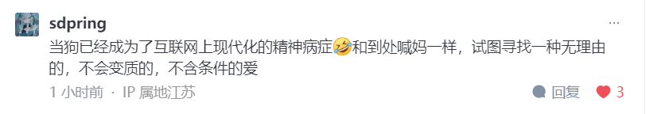

## 
文摘

[你有哪些话想对知乎上关注你的人说？ - 柯烟的回答 - 知乎](https://www.zhihu.com/question/264373660/answer/3476366422)

---

### 悟已往之不谏，知来者之可追

认识到过去的错误已经不可挽回，知道未来的事还值得去追寻。

[《归去来兮辞》](https://so.gushiwen.cn/mingju/juv_a22aedf93624.aspx)

---

#谈恋爱#

**不是早就告诉你，不要和未成年人谈恋爱吗？**

[男生真的很不能接受彩礼吗？ - 9adgq的回答 - 知乎](https://www.zhihu.com/question/398741940/answer/2154154258)

---

#童真# #幼稚#

**童真是过于轻易的相信美好存在。**

它是希望和斗志的源泉。

所以见到的人才都想去保护它，

因为谁也不想给一艘自身没动力的船当拖轮。  

**幼稚是过于轻易的相信丑恶不存在。**

它是失败和亏损的渊薮，

所以见到的人都忍不住嫌弃它，

因为谁也不想自己的拖轮看不见斗大的礁石。

[幼稚和童真的区别是什么？ - 9adgq的回答 - 知乎](https://www.zhihu.com/question/535581708/answer/3472816598)