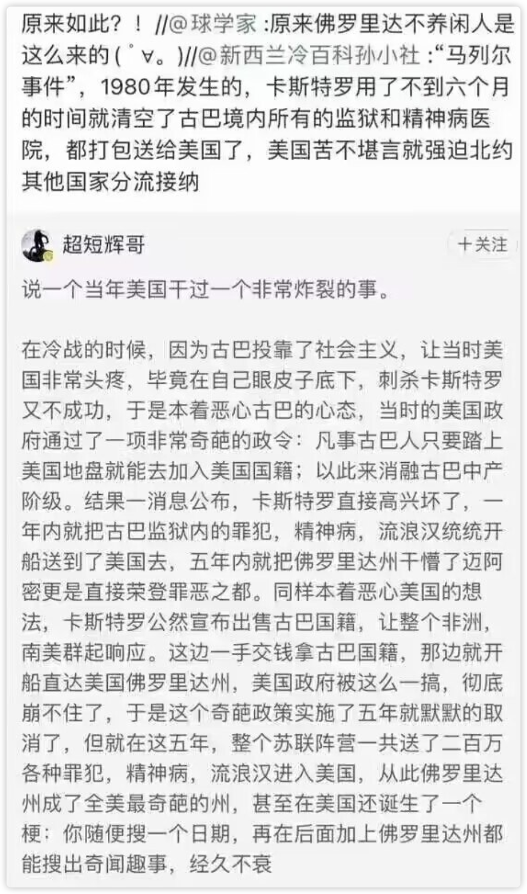

## 
日记

你还没悟，环境对你来说还是很重要的。你并不能够不受这些事情的干扰。

前天看了[【罗肖尼】如何永远学会一个单词？](https://www.bilibili.com/festival/jzj2023?bvid=BV1ns4y1A7fj)以后想每天看5分钟能让你自己觉得有意思的英语书。

内心痛苦就会用食物、用性来填满空洞的内心

## 
文摘

---

#冷暴力#

**不是不说话才算冷暴力，任何单方的，漠视对方回应的表现都可以算一种冷暴力。**

[为什么男生喜欢用冷暴力来结束恋情？ - 菠菜的回答 - 知乎](https://www.zhihu.com/question/302107081/answer/3218607283)

**他让我觉得，我是这个世界上最糟糕的人。**

[我想问下 男生对女生冷暴力的时候男生都咋想的？ - 陈思逸的回答 - 知乎](https://www.zhihu.com/question/311365207/answer/2094572090)

---

#休息#

**休息是要以视死如归的决心才能做到的事。**

你不能休息的原因，根本不是因为别人不给你放假，而是你不能接受休息的后果。

你不能接受因为你没有尽到全力，子女上不了最好的学校。

你不能接受因为你没有尽到全力，眼睁睁的看着家人不能接受最好的治疗，

你不能接受因为你没有尽到全力，错过更好的机会。

如果你休息了——尤其是“过度休息”了——你将成为你和你所爱的人的一切失败和痛苦的第一责任人。

那是因为你们还小，还没有体会过因为就差这么一点努力，眼睁睁的看着一些东西受伤、毁灭、丧失的痛苦。

在父母不再能遮风挡雨、以身相代之后，中年人开始真实的品尝这些滋味。

ta们只要尝过，就知道真正不肯让自己的休息的其实不是客户、不是老板，**而是自己。**

只要你尝过，在你可以视死如归、视家人死如归之前，休息不过是另一种需要准时准点保质保量完成的工作而已，反而是工作本身才能让你稍微击退那些可怕的恐惧。

所以中年人们——真正决定这个社会如何运转的中坚力量——无法是你的同盟军。（反对996制度，中年人不会和我们站在一起）

不，这是提醒你意识到“**视死如归是必须先过的关**”。

#Comment

许多人闲下来也不是在休息，是在踩着刹车加油门，焦虑。

[面对中国目前的大企业996制度，怎么样可以打破这个局面？ - 9adgq的回答 - 知乎](https://www.zhihu.com/question/443196572/answer/2833386622)

你心里觉得休息是罪恶的自然不会好好休息，玩也玩得不尽兴，学也学得不认真。因为你是出于害怕和恐惧而不得不学，不是出于好奇与喜欢才去学习。心不安。踩油门同时踩刹车

---

#土一点# #修辞#

自己对自己讲话朴实一点，直接一点，土一点。

[如何平衡理想和现实？ - 9adgq的回答 - 知乎](https://www.zhihu.com/question/19866801/answer/2177414614)

---

#享乐# #玩# #神性享乐# #学习#

**自己对什么都不感兴趣，对种种人类宝贵的精神财富缺少那种心弦颤动的共鸣，这份麻木和漠然是会传染给子女的。**

**为人父母，却不知世上除了官能快感之外还有什么能让灵魂颤抖的美，这其实是不行的。**

神性的享乐是人的本能追求，即使在衣不蔽体、朝不保夕的部落时代，那些尚未成型的人类就已经可以饿着肚子围着篝火吟唱歌舞了。**因为贫穷、困苦而否决一切精神追求的价值，视为“没用”，是自己在弃绝生而为人的高贵所在，自己要把自己活成野兽、而且要把子女都扭成野兽。**

**这种“实用”论其实是一种可以习得的遗传病。**

---

#自律# #作息# #休息# #想象# #自欺欺人# #引人注目# #伦理观# #价值观# #乡愿#

**你主张朴素、主张勇敢，主张谦卑，或者你主张及时行乐、引人注目、默默无闻不如即时毁灭……这会全面的影响你的衣食住行的选择，进而影响到你能交的朋友、能选的伙伴，进而决定你的作息、你的体重和你的近视度数。**

如果你看了某篇东西，自认为深受感动，但你的服装、发型、工具、家居、待人接物……等等所有的生活细节都没有任何改变，你的这些所谓“领悟”就仅仅只是**想象**和**扮演**而已。

[如何做到极致规律的作息？ - 9adgq的回答 - 知乎](https://www.zhihu.com/question/653480424/answer/3472127031)

---

#意志力# #强效沟通# #乡愿#

你有一天说“不行我太胖了，我要减肥”，然后你家里人就看到你果然严格的蔬菜沙拉有氧操，一次不拉、一点折扣不打，体重直线下降到理想线；

比如，你说我要把这笔烂字改掉，然后就看到你每天垃圾桶里二十张练习纸，三个月以后笔走龙蛇。

无论多么迂回，无论多么曲折，无论多么隐忍，我下定决心攻克的目标，一定会被攻克，我要做到的惩罚，一定会实现。

在此之前，追索绝不会放弃，目标绝不会逃脱。没有侥幸，没有意外，没有妥协。天涯海角，海枯石烂，终必有报。

[为什么女儿的反应这么强烈？ - 9adgq的回答 - 知乎](https://www.zhihu.com/question/633364716/answer/3424618060)