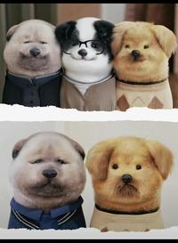

## 
日记

## 
文摘

我混mbti圈实际上是为了找认同，但我发现了，现在知乎上的intp都是“古希腊掌管理性的神”，有时候我挺希望他们的愿望成真，毕竟古希腊真正掌管理性的神，也就是苏格拉底，早就被古希腊人民毒死了。

[不要爱上我这样的人 - 柯烟的文章 - 知乎](https://zhuanlan.zhihu.com/p/690648616)

---

[微信头像会影响第一印象吗？ - 打开盒子吓一跳的回答 - 知乎](https://www.zhihu.com/question/26833362/answer/3468095907)

---

#余华#

三年里那些详细的，苦痛严肃的文字构成了余华老师的精神世界。**他几乎要被这种压力压的精神崩溃。**

[余华是经过怎样的经历才写出《活着》这样悲寂的作品的？ - 墨香的回答 - 知乎](https://www.zhihu.com/question/360064803/answer/2655183494)

---

#亲密关系#

如果是十年前，我会说你关心你男朋友是爱他的表现，你男朋友天天打游戏说明他很不上进。

如果是五年前，我会指责你控制欲太强，把你男朋友管的太严你们迟早得黄。

但是现在，我只会说你没做错任何事，因为女的都这样；而你男朋友也没做错任何事，应该把你的抱怨当鸟叫。过两天你俩自然就和好了。

任何事情都是一样，不上秤没有四两重，上了秤一千斤都不止。只要你还想把日子过下去，那么男女的事情就是一律不得上秤，但凡有一件事上纲上线，你们的日子都会极其悲惨地收尾，所以干脆一律不准上秤。对任何人都一样。

(没有必要非评个对错, 亲密关系当中最忌讳是非分明, 但也不是是非不分。)

[男朋友哄我睡着后往往要一个人打游戏到很晚释放压力，这是为什么？因此分手合适吗？ - 伏罗希洛夫射手的回答 - 知乎](https://www.zhihu.com/question/597228825/answer/3053621032)

---

#亲密关系# #谈恋爱#

你很不幸，把关系中的自己，活成了一个在对方时间线上，需要像通勤，打卡，坐班，擦屁股，撕逼，给父母报喜不报忧的撒谎，明明在摸鱼却要在同事面前演戏扮努力一样的一件恼人心神，不搞定就不会自己消停，不处理自身就难以舒适的stuff。

这是很多女人都get不到的一个关系中的巨大失败。

就是把自己活成了一个关系中的被应付，被handle，被物化的对象。对方在你面前，深感压力，相当抵触，至少是回避，躲逃，推迟，早退，任何无厘头的理由都可以拿出来，甩你脸上，换取片刻的安宁，极其抗拒与你的长时间物理绑定。因为物理绑定中的你，并不消停，一直试图推行本不可能的精神世界的强行交融。

你们看似肉体日日共处一室，卧榻之侧香甜酣睡，实则精神深处激烈排异。

当你成为对方时间线上一个非处理就不消停的stuff的时候，你们的关系已经失衡了。你们看似平等相待，甚至他还受制于你，其实在他的时间线，你和早上艰难通勤之后，像“快乐向前冲”的选手通关触铃，结束计时的打卡机是一样的地位和角色。

**把你哄睡了，自己好独处一下，就是他的一天结束时的精神打卡。**

你成了一个需要被他应付，搪塞，安抚，甚至用“演”才能取信的单线程琐碎事项之一。

而不是一个让他依赖，让他沉迷，让他感觉环境宽松，压力归零，心有联结，愿意分享和物理捆绑的爱人。

**从这个时候开始，你再也难以进入他的精神家园了。你只是他赤脚进入自己独享的精神家园之前，扔掉的鞋子，洗掉的征尘，卸载的零碎和负重罢了。**

[男朋友哄我睡着后往往要一个人打游戏到很晚释放压力，这是为什么？因此分手合适吗？ - 马丁.Success的回答 - 知乎](https://www.zhihu.com/question/597228825/answer/3053929468)

---

#我是谁# #人格独立#

**不知道自己是谁。**

在我看来，只有两种人。

第一种，“如果我不干什么事，我就会面临怎样的悲剧”。

第二种，“我想干什么事，我该如何达成”。

第一种人，是被恐惧和担忧驱动的。

第二种人，是被自己的渴望和热情驱动的。

**被什么驱动，你就可以被什么定义。**

被恐惧和担忧驱动的人，你和身边的人有什么区别？没什么区别。你们的特点就是摆脱恐惧。

被渴望和热情驱动的人，是独特的。因为每个人的渴望和热情不一样。

这和经济条件、家庭背景没有关系。同样是草根，有些人就可以活出自我，有些人就一直在挣脱恐惧。

“活出自我”和“挣脱恐惧”的区别，不在于你过的具体的生活，而在于你如何看待你目前的生活。你活着是为了不再害怕担忧，还是，你征服恐惧是为了追逐热情。目的不一样，心态就不一样，精神面貌就不一样。

这一切，都取决于，你敢不敢不再逃跑，站住，深刻地问自己一句，“我为什么而活”。

当你不再因为逃避恐惧而仓皇麻木，你就可以体察到你的热情了。那是你从娘胎里带出来的，你需要去发掘它。

[一个没有性张力的人的明显标志是什么？ - 胆小男孩做大事的回答 - 知乎](https://www.zhihu.com/question/645204743/answer/3478872558)

---

#复读机#

所以回到你说的“常常复述别人观点”这个事。这件事的重点不在于引用别人观点，因为所有的观点的形成都是建立在前人已有的观点上。

**真正的【重点】在于，你是否可以清晰的追溯观点的起源和发展脉络。也就是有系统的了解一个观点。这才是你不仅能引用，还可以批判旧观点并发展新观点的关键。**

举个例子，你听别人说“种族歧视不好”这个观点，如果你单纯重复这个观点，那么你就是复读机。但是你还可以做到的是，

追溯这个观点的起源，

什么是种族歧视？

什么是种族？

什么是歧视？

在什么语境下产生的这个论点？

这些年这个论点的内容有没有改变过？

该如何应用于不同的语境？

[如何摆脱自己复读机的状态？ - nell nell的回答 - 知乎](https://www.zhihu.com/question/295966838/answer/620003302)

---

#哲学# #低智文化# #社会学#

与其说是“歧视”与“娇妻文学”的泛滥，不如说经济下行的压力。

我是个南方人，我在北方读了十年书，两边的观点我都能理解。

首先，这个词的确是南方人自称，然后北方人觉着还挺可爱的，所以拿过来当了昵称。

其次，在南方人眼里，这种词的确是不好听的，毕竟我从小到大的教育告诉我，不要随便攻击其他人的容貌、身材、体型，如果非要攻击一个人，那么就要攻击ta自己能改变却没改变的东西。但是我来北方之后，发现北方人吵架主要攻击的就是改变不了的东西，“只要没咬死你都算我的仁慈”，也就是说很多回答中说的“如果我真的要骂你，我能挑出更难听的词”。

最后，就我个人来讲，这个词之所以引发了我的恶感，还是因为它逐渐变成了娇妻文学。“小土豆”被认为是弱势群体，与本土群体区分开，我们需要被照顾、被领养、被呵护，如果你还是个i人，这种感觉就更明显了，南方小土豆、i人、女性，这三个buff一叠，人就已经被当成金丝雀待价而沽了。

我也理解很多北方人、男性、e人觉着这个很矫情，“照顾你还不好啊？”“得了便宜还卖乖！”“就是玩梗，你怎么还玩不起呢？”

从2018年以后，我们就一直在喊“经济下行”“消费降级”，但是很多人根本没有意识到这到底会对我们的文化有什么影响，批判“娇妻文学”的时候往往追溯到封建地主阶级的嫡庶文化，好像这群人生来就是裹小脑。

**但是一种低智文化得以流行，并不是一句“不思考、没文化”能解释的。**

东航出事的时候，全网一片“呼呼呼不疼了”，看得我头皮发麻，当时我就很不舒服，在想为什么要用这种说辞来稀释生死的严肃性，后来，娇妻文学这个概念越来越火，什么宝宝碗，什么尊嘟假嘟，天呐，能不能把这个世界还给我们成年人，我们要打游戏，游戏里的血是红的不是绿的，我们说话不会模仿婴儿，我们既不是巨婴，也不是娇妻，我们就是个正常人啊！

我一直都理解不了到底是谁在喜欢娇妻文学？

在这种二元对立的强弱框架中，为什么有人自愿成为弱者，要成为“被老公照顾的妻子”、“被e人带着社交的i人”、“被东北大哥呵护的南方甜妹”？

这些话语就像相互配合的边牧，要把我赶回家庭，当个情绪价值提供机。

因为我学哲学嘛，所以我很早就意识到我对现实是不敏感的，为了弥补这种缺陷，我每年都会找个时间段搞点钱，用赚钱是否容易来判断我未来的走向。

我是个intp，最适合我赚钱的方法有三个，一个是股票、基金、外汇、币圈、贵金属、期货这种，我一般都能维持小赚不亏，币圈如果猛的话，我甚至能大赚；一个是写小说，18年19年的时候，这种赚钱方式还是很简单的；还有一种是咸鱼挂课程辅导，是的，我的学历还是有点用，这个赚钱比较慢，纯属找人聊会儿天，就是锻炼一下自己社交能力（

今年，大家也知道a股大盘的情况嘛，写小说也不像以前那样赚钱了，咸鱼上全是要求考研辅导的，打开新闻一看，房地产暴雷，地方政府财政支撑不住，公务员教师开始降薪，考公考研的难度都变大。

就连我自己，都会在写论文的时候忍不住想：“要不然我还是回家生孩子去吧，这个博士学位老子不要了”，在某个深夜，我被师妹的论文措辞气的恨不能倒立吃屎的时候，突然福至心灵：“找个人替我活吧，我不需要主体性了”。

那一瞬间，我突然共情了娇妻文学。

我想起1933年经济危机发生的时候，女性回归家庭，男性独自在职场挨骂受气，全球最火热的商品是口红、火柴、香烟和避孕套。

那些被资本主义倒掉的牛奶变成了娇妻口中的“奶乎乎”“奶嗝”“奶屁”，什么叫内循环啊，什么叫供给侧改革，这就是。

出口转内销是个谎言，越是经济下行，储蓄就会变成一种社会选择，消费的降级是一种短期内的自保手段，但是降费降级带来的生活品质下降一定会导致身体素质的下降。

钱是不可能凭空产生的，市场从来不是慈善机构，降本增效只是一针肾上腺素，这个回旋镖迟早要回来的。

牛奶是需要被浪费的，就好像摇摇欲坠的贾府要用奢华撑起它的体面一样。

淄博为什么火，哈尔滨为什么火，说到底还是国际局势不好，只能靠内需拉动经济发展，但是经济下行的信号就像暗恋一样，捂住嘴巴，也会从眼睛里透出来，所以大家开始注重性价比，网上阴谋论一堆，其实政治没有那么复杂，太复杂的计划涉及太多人，痕迹总会被翻找出来的，实际上这俩地方火起来就一个原因：

大家都没钱了，所以大家开始注重精神上的享受，需要花很少的钱获得很多的重视。

现在就是旅游业的降本增效，我们都将度过一段不容易的时光。

在这种情况下，你要说哈尔滨用“小土豆”侮辱你，那是真的不可能，更好笑的是，连娇妻文学都在讨好你。

问我怎么办呢，我也不知道，书里也没写啊（悲

2024.1.16更新

有些人连我的核心观点都看不懂就开始抓着mbti猛喷，在这说“学哲学的还信mbti”。

也就我这种学哲学的，承认观点优先于立场，才愿意把你当个人给你解释。

如果我跟你一样，把观点立场化，把国家脸谱化，把经济政治化，把涉及底层逻辑的东西说成上纲上线，拿着自己刚学的“刻奇”就开始乱用，那我才不配学哲学。

当然，学哲学哪里有什么配不配的，学都学了，还能怎么办呢（摆烂

我的观点很简单：东北人并非出于歧视的目的使用“小土豆”，但这种话语的流行代表着“歧视弱者”的时代即将来临，没有人幸免于难。

小土豆的流行与批判，实际上是“经济下行”与“思想自由”的冲突。

经济下行意味着岗位减少、消费减少、艰难维生，而大多数人并不是出生于经济下行期的，包括我在内，我们接受的教育是“经济上升期”的思想观念，所以我们的话语体系中充满了“个人价值的宣扬”、“女性意识的觉醒”、“对产品和服务的高要求”。

我不得不承认的是，我将来能找到的工作一定跟我的教育投入不成正比，我将要受到的侮辱和歧视会更多，教育水平、专业方向、性别、地域、甚至连喜好都会成为我被刷掉的理由。

这并不意味着赢过我的人就多么幸福，降本增效是应对经济下行的无效内卷。

最可悲的是，所有人都没有错，只是我们搭乘的船要沉了。

我们都需要拼尽一切往上爬，我们想要活得好，需要我们爬的速度超过船下沉的速度，而这注定是不会被我们的上一辈所理解的，因为他们只需要保证自己下跌的速度不超过国家上升的速度就能活得不错。

所以我们将要面临的命运是：在职场里小心翼翼、在家庭里口干舌燥、在深夜里怀念过去、在清晨怀疑自己。

有些围城已经在无形中建立起来了，我很担心我被困在其中，**终日为不可得之物痛苦。**

非要论证我的观点，那我得从央地关系、条块关系、政治与经济、国家与社会的关系开始讲恒大暴雷、房地产泡沫、地方财政空虚、公务员降薪、考研考公热，但是我上知乎不是为了科普的，我就是来找乐子的，我最喜欢的乐子就是mbti。

和某些“只要是流行的东西就不正确”的小众爱好者不同，我认为现象的流行必然折射某种本质的规律，**mbti的流行实际上反映的是我们这一代青年模糊的自我认知以及社交活动的缺乏带来的社交无力。**

我们既需要独特性，也需要差别，我们既需要了解自己，也希望了解他人。

如果你觉着mbti很烦，那是因为你不是mbti的受众，你没有因为“内向”被骂过“书呆子”，没有因为热爱文学和哲学被骂“矫情b”，没有说过不合时宜的话被谴责“不会来事儿”，没有因为习惯维持所有的开放性被骂“优柔寡断”。

**我喜欢mbti就跟我在抑郁的时候喜欢算命而不是看心理医生一样，我并不是觉着它说得对，而是我找个方式听一点我想听的话。**

你是唯物主义者，我也是。

**但是你很快乐，我没有。**

我讨厌娇妻文学，因为“老公对我真好”“老公把我这个小废物放在手心里哄”这种娇妻文学，会拉高女性对男性的期待，也降低女性对自己的期待，**把主体性交出去之后，就很难拿回来了。**

**日本女性、韩国女性的地位，始终令我感同身受、触目惊心。**

写到这里，我都能想象部分男性要吐槽“女拳女拳”，哎，真的，诸君听我一言：网上的男女对立，对普通人来讲，只有坏处，没有好处。

你去看看日本和韩国的男性，**女性交出主体性之后，男性并没有过得更好。**

歧视从来不会只落在一个性别身上，**歧视只会从强者落在弱者身上，从多数落在少数身上。**

娇妻文学只宣扬“成为娇妻”的好处，它不会告诉你：

**你为爱当娇妻，但爱会消失，你为钱当娇妻，但钱会花完。**

**你是装饰，但你也会变成累赘。**

哎，就这样吧，我也是吃饱了撑的在这里好为人师。

我再说一遍：我并没有表达我的赞成和反对，网上吵得再凶，都没什么用，现实中往往是看语境表达情感的，而不是靠概念。

抓着概念猛批评或者抓住概念的批评猛批评都是无用的。

这里就展现了我作为intp的特征了：我支持所有善意，反对所有恶意，理解所有存在，但不表达自身偏好，因为我觉着我的意见不重要。

我不是为了当意见领袖写这个回答的，我只是在等外卖时刻随便聊一点罢了。

[最近网络流行词汇小土豆，真的没有歧视吗？ - 柯烟的回答 - 知乎](https://www.zhihu.com/question/637287304/answer/3359360443)