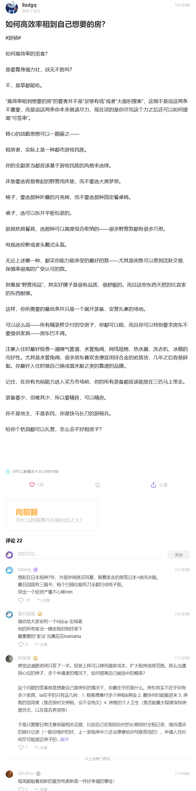

## 
日记

今天没碰到靳迪，有点失落，生活又恢复波澜不惊了，哈哈

## 
文摘

#不该做的事#

我们做的许多不想做的事情，实际上很容易开始做，比如很容易开始喝酒，或者很容易打开抖音。

如果你想停止做这些事，首先就是要设法增加障碍，让自己很难开始做它们。

[科技爱好者周刊#299：AI 的关键是语料](https://mp.weixin.qq.com/s/zhjYPTY03GDIvcP5Mbx-3Q)

---

#租房#

[如何高效率租到自己想要的房？](https://afdian.net/p/ae7400400dd011efab3452540025c377)

---

#讨厌的人# #相似的人#

**因为人往往讨厌的就是与自己相似的人。**

**技能get越多，讨厌的人就越少。**

**无敌之所以寂寞，是因为再也无人可讨厌了。**

[如何证明你不是你所讨厌的那种人？ - nell nell的回答 - 知乎](https://www.zhihu.com/question/363131259/answer/1520967096)

---

#吃苦# #上一辈# #共情#

他们无法理解给你好吃好喝为何还苦闷？有学上有书读为何还空虚？好不容易找到工作挣了钱为何还不满意？

物质条件这么好了，苦从何来？

他们不能理解有一种精神上的苦比肉体上的苦更加难以承受。

生活没有不苦的，这跟年代没有关系。一个年代自有一个年代的挑战，一代人自有一代人的苦闷。都是如鱼饮水，冷暖自知。

[中国现在的年轻人吃不了苦了吗？ - nell nell的回答 - 知乎](https://www.zhihu.com/question/431571293/answer/1631364941)