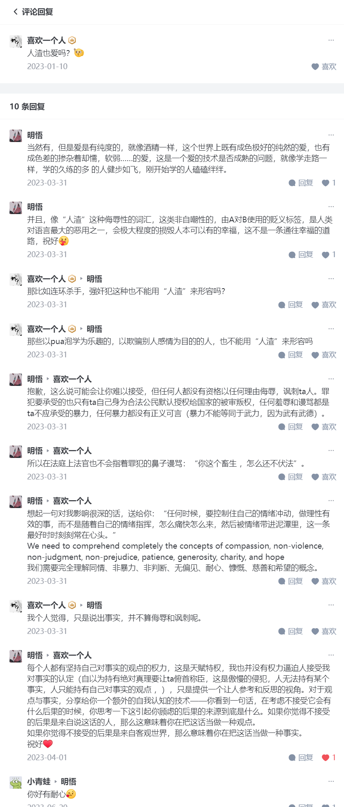

## 
日记

今天又碰见靳迪了，但是感觉没话可讲。你想跟她说点什么吗？

## 
文摘

#乌龙茶# #苦熬# #万念俱灰# #希望#

**真正的苦，是没了希望本身——不知道还该指望什么、也不知道还能指望什么，即使有所指望，也完全没有任何它能实现的信心。**

[你最苦的时候是什么时候，是怎么熬过来的？ - 9adgq的回答 - 知乎](https://www.zhihu.com/question/52515464/answer/578881811)

---

#恋爱# #分手# #原则# #对不起#

恰恰相反，如果对方能穿越由此而来的痛苦、不服气（本质不过是傲慢）、怨恨（本质不过是贪婪），能看懂这件事的份量，能明白这条红线的不可逾越，能以真诚抱歉、没有怨恨、认同你的分手决定确实并非没有道理的状态给你回应，那么这份感情可以重生。

而且才真正算是活着了。

**这之前，不过是过家家、彼此耽误彼此的人生罢了。**

**只有经过分手，经过以分手为必经之路的基本共识的重新修订，这个关系才可以继续。否则勉强继续，必无善了。这件事的流毒遗患会不断的反复发作、一轮一轮的消耗彼此的感情羁绊，直到彻底恩断义绝。**

那时候如果婚已经结了、孩子也生了、工也辞了，再彻彻底底的恩断义绝，比此刻分手惨烈何止百倍？

刮骨疗毒，十天半个月，治好就好了——若对方确实转不过这个弯，那么你只是躲过了一个沦为奴仆的未来。

含糊过去，它甚至将成为“这样没啥不行”的事实依据，贻害至烈。

你有必要向对方抱歉——

“对不起，我没有在这之前足够清晰明确的告诉你我的这一条别扭之处。我为可能耽误了你寻找理想伴侣的时间而抱歉。我更不应该理所当然将我个人的原则强加在你身上，自以为正当的因为你没有符合我自己的期待而朝你发泄情绪。我错了，请你原谅。

但这些并没有改变这是我无法接受的原则的事实。如果你确实觉得你的想法是对的，那么我们无法有效的共同生活，我也没有理由、没有立场再耽误你更多了，因为我的确无法接受这样的安排。”

评论：

分手就是真分手，一切以分手作为手段的想法都很扯淡

[男朋友出于好心给我的茶里下止痛药，我知情后非常愤怒，请问到底是谁的问题？ - 9adgq的回答 - 知乎](https://www.zhihu.com/question/446736682/answer/1753809533)

---

#诛心之问# #谎言# #逃避# #自欺# #无伤大雅# #宠爱#

**第二，现在绝大多数人对待自己家庭成员的方式是错的，是一种极无原则、极无远见、进而是极不负责任的毁灭性的放纵。** 这种待遇，其实是一种伤害。尽管人类的本性都会羡慕那种泡蜜饯式的对待，乃至于会不假思索的以为“像对待家人一样”一定是一种享受的提升。

但问题是首先你就不会选择那种注定会把一时的侥幸变成三世而斩的灾难的对待家人的方式。

你对待至亲家人的方式，既然就不会是一种“甜蜜蜜”的做法，那么争取获得你的家人待遇，本身就是一种勇敢者游戏。没有特殊的人生观、价值观的育成，**把这种爱加诸于实际上只想要宠爱的人们身上，本身甚至是一种残忍**。

你又何必对别人这么“恶劣”呢？

**要练出这种能力，你将需要一次次的用无可逃避的诛心之问把小兔崽子心里本能会有的谎言、逃避、自欺击碎，一次次把真实的他自己呈现给他看，一次次让他在被洞察之后感到惊恐、一次次在被原谅后痛苦忏悔。一次次把他从常人完全可以接着“无伤大雅”的自欺维持的舒适区的赶出来，让他直面将来的现实。**

**一次次让他看到你如何原谅他绝不可能饶恕的凶恶。如何化敌为友。如何不必靠阴谋算计，靠信仰和实力让恶意的攻击自行瓦解。**

**这整个过程，你要适可而止。即使是你的血脉，也未必就能受得住。要继承这个位置，这些历练是不可回避的。优先训练你自己的骨肉，可以算是你真正的一点私心。这是最可令人的一生不虚度的直路，有可能的话，当然要尽量让你的子女试一试。**

**但是这也是一条寻常人会觉得很痛苦的路。你也不能勉强。**

[该不该把保姆当家人看待？ - 9adgq的回答 - 知乎](https://www.zhihu.com/question/68780501/answer/1047183701)

---

#爱是一种属性#

**“爱”本身就是光源，它应该是你的属性。如果你是一个“有爱”的人，那么你置身哪里，哪里就有光亮。你在有爱的人身边，你们彼此照亮；你在黑暗中，黑暗也会被驱赶。**

[爱的对象是否有选择以及爱是否有深浅? - nell nell的回答 - 知乎](https://www.zhihu.com/question/524163583/answer/2407823439)

---

#主体性#

> 我一直觉着我的哲学水平吊打我的同学，直到有一次我和我已经毕业的同学喝酒，他说，政治搞不明白的人才去搞哲学嘛，但凡你熟悉政治，你就知道大多数人需要的根本不是一个哲学家来教导他们怎么才能过好一生，而是一个政治家来告诉他们现在就是他们最好的人生。哲学对大众太苛刻了，不仅要求人思考，还要求人行动，政治就好很多，只需要一个人从众地不思考。
>
> 可能因为我学的是政治哲学，所以我还是比较从众的。比如前段时间，小红书上比较流行的电脑屏保是“xx大学把我害惨了”，我也比较尊重流行，所以我也给我的电脑换上了**大学把我害惨了，那一周组会，当这个屏保被投影在大屏幕上的时候，我突然开始思考，我导师看见这个是不是不太合适。
>
> 这时候我就意识到了，当思考对改变现状没有帮助的时候，谁让我思考，我就恨谁。我们和其他人的区别在于，大多数人都不会选择把自己放在这个被憎恨的对象里，但是我们学哲学的人就会把自己作为最主要的憎恨对象。我一开始还觉着这是因为我们比较谦虚，后来我发现，我可能还是谦虚过头了，我之所以这么想，主要是因为我认为这个世界上能促使我思考的人只有我自己，只有我一个人具有主体性。
> 傲慢，太傲慢了。
>
> 所以我决定把主体性像爱一样播撒人间，开始非常谦虚地憎恨着我的导师、我的母校、这个社会还有所有人类。
>
> 人人都有，甚至连拟人的标签都有。
>
> 说起拟人的标签，就不得不提mbti了。现在mbti比较火对吧，你是e人我是i人，大家和和气气的，但我发现这个回答不能特别具体，比如我说我是个intp，那完了，懂的人觉着我在装b，不懂的人还是觉着我在装b。你说什么时候，发生在人身上的善意才能这么积极和统一。
>
> 我测mbti比较早，那时候版本爹还是infp，后来版本爹轮到了infj，再后来是intj，现在终于轮到了intp。
>
> 垂死病中惊坐起，版本爹竟然是我自己。
>
> 我以为成为版本爹，至少能让我获得更多的认同感。但我发现，认同感这个东西，好像只有成功者才能享用。

[为什么我越来越讨厌哲学？ - 柯烟的回答 - 知乎](https://www.zhihu.com/question/582175186/answer/3492742865)