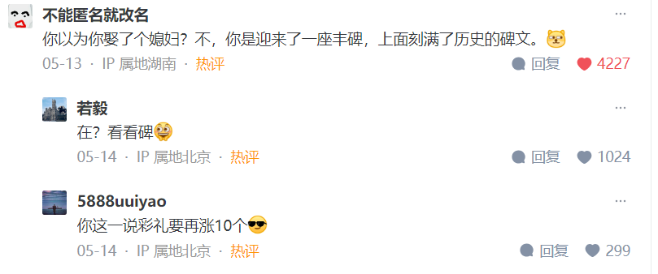

## 
日记

语言无法做到完备的表达。

人类的语言，用语言来表达我们对道的领会是什么？极困难。语言有它的局限性的。然后它就让我们中国人把佛学中国化，最高成果禅宗。禅宗主张什么？主张我们不是通过言说和文字来悟的。当悟的时候，我们是说不出来的。知识是一定要说得出来。你学了牛顿三大运动定律，怎么好说不出来呢？还要能够解题目呢。你现在说你悟了，我问你，你悟到什么？你说的出吗？你说出来的一定不是悟到的，而是知到。这是两码事。语言是什么？可以把它比喻为梯子，攀登城楼的梯子。就是我们修行，禅宗修行，往上攀登，到什么？终于到了城顶了，城楼顶上。你还说话，等于说你还没到顶上，你还站在于梯子上。语言就是登城的梯子，到了城顶上，梯子自然就撤了，也就是语言不用了。你还能说，没到顶呢，没到城楼顶上呢，它只能证明这一点。所以说佛法的人，如果他是真非常好的一个禅宗祖，能讲经说法，是吧？就是所谓为我们开悟。开悟，悟还是要靠我们自己的。那个文字直接传到你耳朵里，你去理解它了，你没悟，还是没悟，但他还是跟你说了。他跟你说是为了什么？终于达到不可说那个境界。这叫什么？心法传给你了。禅宗是传心法的心法，心法又叫密意。这话有道理。密意，什么叫密意？无法形诸文字，无法形诸语言，所以它就密意。我们中国人后来真是，禅宗是佛学中国化最高成果。虽然它最初是达摩传进来的，叫初祖达摩，印度人。但是禅宗没有奠定基础，它只是从灵山法会那里传心法开始。释迦摩尼因人而异说佛法，我天下众生差别很大。有的人，他跟他讲讲净土宗，那么净土宗当然也来自释迦摩尼的说法了。有意思就是，释迦摩尼不说话，是吧？拈花一笑。底下有个迦叶尊者，会心一笑。这个成语就来了，叫心心相印。就不说话的。这叫传心法第一次，第一次传心法。传的是什么？心印，不是手印。

还记得《坛经》吗？里边不是讲慧能让慧明悟吗？慧明要把衣钵夺回去，后来夺不成，因为慧能把衣钵放在一块大石头上，自己躲在草丛里，是吧？那么跟慧明说这衣你搬不动。慧明不相信了，去搬，果然搬不动。那就没办法了。他说，我不为衣来，我为法来，我是来求佛法的。好。你像一个禅宗祖师，虽然这时候的慧能尚未剃度出家，其实已经是第六组了吧？已经是禅宗祖师了。你像一个禅宗的祖师，不是密宗的祖师，也不是什么律宗、天台宗的祖师求佛法，他能给你什么佛法？心法，是吧？他肯定是给你心法。给你心法怎么给呢？先教他坐下。慧明你要听佛法，可以的，现在请你坐下。那么慧明就坐下来。然后慧能就跟他讲，屏息诸念，把你头脑中的，脑子、心里的各种念头都放下来。这等于叫他什么？打坐。并不是我们通常期待的。我们找到一个大和尚，请他说佛法，那么我们大家坐好，他就开始说佛法了。不是怎么回事，那是其他宗派的事。禅宗不这样的，叫他先打坐，屏息诸念。良久，就过了很长一段沉默的时间。那么慧能终于开口说话了。他会不会很长篇大论？不可能，就两句话，但他确实是说话。一句话，不思善，不思恶。第二句话，正么时，那个是明上座本来面目。这两句话说下去，这两句话之后，再也没什么话好说了。
这两句话说下去，能否产生效果，就看什么？就看慧能这一次抓的机缘，抓的准还是不准。这是禅宗祖师的本事。他抓准了这个机缘，一是机，二是缘。机是什么？慧明这个人的特征，慧能抓住了。缘是什么？争夺衣钵这件事，这叫缘。没这件事还不行，你还悟不了呢。恰好慧明这个人的机叫什么？爱憎分明，善恶分明，衣钵不能让你慧能的，因为你都还没出家，尚未剃度。这是他的机。缘是什么？衣钵该谁得，这个争执，这件事蛮大的，这叫缘。缘和机合起来叫机缘，抓准了。第一句话投他的机，第二句话把这个缘说出来。所以两句话一来以后呢慧明悟了。慧明悟了，说得出来吗？能说话吗？悟了什么？一，善恶区分，拿掉了，是吧？就这件事情跟道德没关系，而是谁能够担当佛法的大任，传扬佛法的大任。第二，把慧明这个小我拿掉了。明上座不是你的本来面目吧？如果是，那你当初什么四品将军呢？如果四品将军是你本来面目，怎么会成为弘忍法师的上座弟子呢？看来都不是你的本来面目。一下子把小我夺了，把慧明这个人夺了，前面叫夺境，后面叫夺人。境也夺了，人也夺了，叫人境俱夺，就抢夺的夺字。还剩下什么？虚无。这一刻，慧明的心跟虚无契合了，叫无。他跟虚无，他的心跟虚无契合了。虚无，请注意，说得出来吗？没话好说的。你理解了牛顿三大运动定律，要说得出来的。现在不是什么三大运动定律，是虚无，你知道吧？说不出来。但是慧明说了，还是说了。他说什么？无限感慨，他说了一句，如人饮水，冷暖自知。这话就说对了，不是他悟到什么，而是他悟的时候的最真切的感受。悟是我们的心灵最真切的受用，这受用来了，不是认识来了，那是最真切的受用。这种受用无法用语言表达，叫什么？冷暖自知。这是悟所达到的心灵感受。在悟的时候的心灵感受叫什么？最真切的受用。最真切的受用是无法表达的。有的人在人生的道路上栽了一个大跟头，这个跟头就是他悟的机缘，你知道吧？他一旦成功了，悟了，人就变了嘛。表面上看还是原来那个人。不异旧时人，只异旧时行履处。就以前他怎么实践，今天的实践跟以前的实践不一样了，生命实践不一样了，他自己明白，他也没办法传授给你，他在此受用之中。

——王德峰《庄子》

## 
文摘

毕竟，这世上最令人崩溃的并不是重大惨烈的人生变故，而是历经一系列变故之后再也无法被重建的三观。

[你曾庆幸自己做过什么事？ - Z·777的回答 - 知乎](https://www.zhihu.com/question/578726549/answer/3503570328)

---

那就学习live with it。

忘不了就狠狠地记住。

比如用它作为母体去创造，写小说，画画，拍片子，做一首歌，设计个研究课题……形式不限，变着样的把它呈现出来，拿到光天化日之下，把它研究的透透的、看的真真的。

你越惧怕它对你权柄越大，越想逃它越追赶你。所以索性转过身来迎接它，注视它，理解它，接纳它是你生命中不可或缺的一部分。

痛苦的记忆这种东西没有任何主体性，是你赋予了它主体性，它才能折磨你。

你把它客体化，就会发现它其实老实的很，你以为是吃人的老虎，其实它就是只小绵羊，不仅吃不了你，你还可以从它身上挤出奶来为自己所用。

你是被痛苦的回忆吞吃掉，还是利用它滋养生命，这事外人决定不了，只有你自己能决定。因为只有你是自己的主人。

[那些痛苦的回忆总是忘不掉 总是会跳出来折磨我怎么办? - nell nell的回答 - 知乎](https://www.zhihu.com/question/497409776/answer/3503064764)

---

#失去# #恋爱#

女性的困境来源于“用失去证明重要”。

你失去这个人感到很痛苦，不代表这个人很重要，任何的失去都会让你伤痛，而伤痛的等级不等同于爱的等级。

没关系的，如果他要因为读博放弃你，也不一定是因为他不爱你，可能只是那个选择更符合自己的人生规划。

我希望所有的女性都能在爱情里成为一个消费者，你为他提供的所有东西都是为了你自己的体验，你随时可以终止它，即使你很痛苦。

[问男朋友会为了我放弃读博吗，男朋友毫不犹豫说不会，这种情况还要继续下去吗？ - 柯烟的回答 - 知乎](https://www.zhihu.com/question/656336474/answer/3503149459)

---

#表白# #恋爱#

与其去学什么鬼打架的“表白”邪术，你还不如多学几段相声、几门乐器、甚至学会翻几个跟头都比这个强。

跟你呆一起无话可说，次次都觉得浪费时间，想到你也要去人家都犯愁，都在苦恼没有不去的借口，那还谈啥？你还指望啥绝妙的表白让对方缴械投降？

跟你呆一起每一次都笑得直不起腰，次次茅塞顿开一语惊醒梦中人，如沐春风，相见恨晚，意犹未尽，还没散场就问你下次啥时候，到了末班车还问能不能续摊，你直接报房号都行。

#Comment

还是那句话 提高自己爱人的能力 吸引对方靠近 哪怕最后没成对方也不后悔认识你
而不是上来就像个贪心的小孩要求别人给糖🍬吃
答主的答案看多了 就知道真的方方面面在践行爱的原则啊

[如何向自己喜欢的对象表达好感? - 9adgq的回答 - 知乎](https://www.zhihu.com/question/655935410/answer/3502853319)

---

#藏品# #历史#

开宗明义——《向日葵》、《蒙娜丽莎》、《自然哲学原理》手稿、《兰亭集序》，柏林墙砖、白虎团残旗这类承载历史的“历史孤品”本质上是人类文明的“原始股权证”，是人类文明价值信用体系的发行锚定物，是一切信用货币最底层的“黄金储备”。

所以，它们的公允价格会跟人类总GDP经“市盈率”调整之后的总市值保持同步。

你有兴趣可以选一篮子有良好拍卖纪录的传世作品，拿来和世界总体GDP的曲线做一下对比，验证一下这个看法。

[什么东西在现在值得收藏？ - 9adgq的回答 - 知乎](https://www.zhihu.com/question/338197094/answer/3422624523)

---

#兰亭集序# #滕王阁序# #岳阳楼记#

[如果《滕王阁序》是被人在高考作文中写出来的，这篇文章会被打多少分？ - 南行兮的回答 - 知乎](https://www.zhihu.com/question/387760431/answer/2587062535)

---

#傲慢# #自卑#

#Comment

极度的自卑与极端的傲慢其实是一体两面的。

[我原本很喜欢一个男生，可知道他也喜欢我的时候，我会开始远离他并且恶心，我这种人真的不应该谈恋爱吗? - 9adgq的回答 - 知乎](https://www.zhihu.com/question/524313516/answer/2416156623)

---

#历史#

[三十九岁的女人真的嫁不出去吗？? - 喀郎什塔德水兵的回答 - 知乎](https://www.zhihu.com/question/654187246/answer/3495641254)

---

