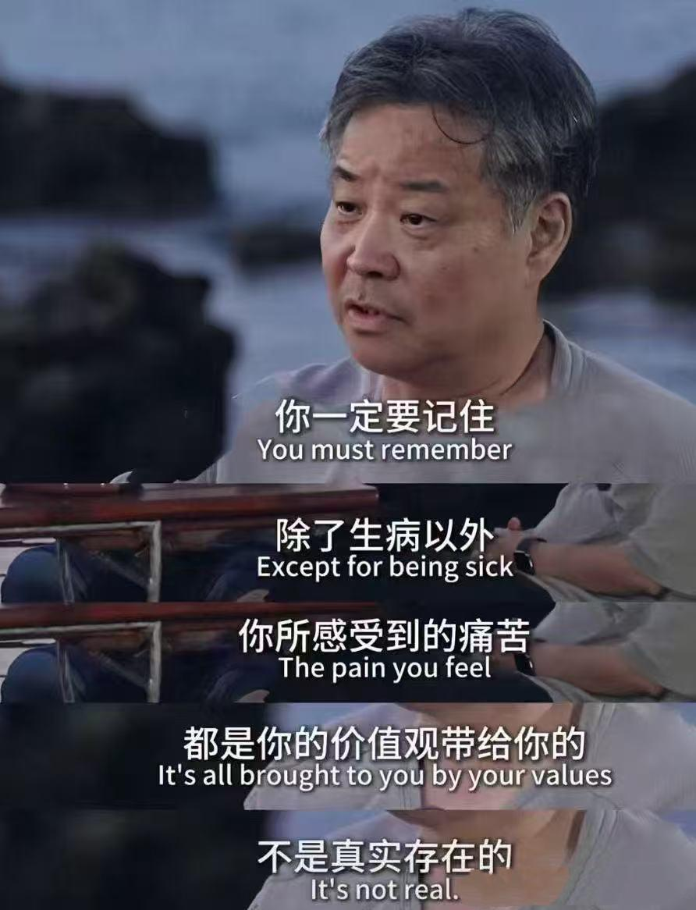

## 
阅读记录

## 2025-02-02
[如何反驳「凭什么我们几代人的努力凭你寒窗苦读 10 余年就超越」？ - q9adg的回答 - 知乎](https://www.zhihu.com/question/431601536/answer/1690740358)

---

[怎么评价程序员40岁了竟然还在撸代码？ - 寒沙的回答 - 知乎](https://www.zhihu.com/question/511856781/answer/65329431060)

---

[数据显示今年全国观影人次减少 3.6 亿，为什么大家都不爱去看电影了？是片太烂还是大家不想花钱了？ - q9adg的回答 - 知乎](https://www.zhihu.com/question/7851676737/answer/68731173811)

没有工作不必急，降低消耗，不断寻找的同时利用这段难得的机会成本较低的时间好好学学专业、多深入了解和广泛接触自己行内的前辈和同行。

---

[人如何克服自己的懒散习性？ - q9adg的回答 - 知乎](https://www.zhihu.com/question/266429882/answer/1413609374)

---

[如何提高对“我正在被生活毒打”这一点的敏感度？](https://afdian.com/p/5f1111fae74111efb26d52540025c377)

---

## 2025-02-17

**一切你曾有的成功，首先都依赖于没有发生过无法提前预料、无法控制、也无法补偿的突发风险，而不是首先依赖于你的努力。**

**你首先是【幸运的】，然后才是【努力的】。你过往的成功，你自己的努力本来就只占有很小的一部分“功劳”。【幸运】才是它们得以实现的主要原因。**

我的一切成功实在首先是受赐与天

[悲观的人如何能变得乐观？ - q9adg的回答 - 知乎](https://www.zhihu.com/question/266034365/answer/557697304)

---

[家庭对一个人影响有多大? - 河森堡的回答 - 知乎](https://www.zhihu.com/question/424069975/answer/2508571341)

在影片的最后，主角母亲住院，在病床上昏睡，郝蕾帮母亲擦干净身体，又梳好头，接着自己默默走到病房窗户前，看着玻璃外的朦胧夜色喃喃地说：“好安静啊，你安静了这个世界就安静了，就让我们这样安静地待一会儿吧，如果你醒来一定会骂我......”

---

为了多巴胺。你没听错，就是为了大脑分泌的一种物质。你仔细想一想，在你极度兴奋快乐的时候。你还会考虑人生为了什么么。如果，你每天都这么快乐。那还管什么人生的意义

[人生活拼命努力究竟是为了什么？ - fatebyme的回答 - 知乎](https://www.zhihu.com/question/481059999/answer/2090667666)

---

[当你心累，万念俱灰，感觉快要撑不下去的时候，是怎么调节自己的？ - nell nell的回答 - 知乎](https://www.zhihu.com/question/309145061/answer/1602715659)

---

性需求完全是心理需求。

谁要拿“生理需求说”在这方面跟你套瓷，扭头就走。

憋死这sob，为民除害，功德无量。

君子疾夫舍曰欲之而必为之辞，记住这句话。

要就是要，直接说要，不要伪装成“不得不要”。

不要觉得这种人可怜，要保持正确的恶心。

[请问生理需求和心理需求哪个更重要？ - q9adg的回答 - 知乎](https://www.zhihu.com/question/568767327/answer/73362335785)

---

[不成熟的正义冲动比海滩上的沙都便宜 - q9adg的想法 - 知乎](https://www.zhihu.com/pin/1611732383689822208)

---

[厦门房子还敢买吗？ - Travis的回答 - 知乎](https://www.zhihu.com/question/534933697/answer/3630212637)

---

[反直觉的观点星日马的想法 - 知乎](https://www.zhihu.com/pin/1874753664666693632)

我有一个反直觉的观点：普通人想逆天改命，就要放肆地活着。
​
​放肆哭，放肆笑，放肆爱，放肆恨。

大部分人都不会这么做，大部分人只会：

-用 title 包装自己，刻意打造专业人设
-给予爱的时候，小心翼翼，抠抠搜搜，反复权衡
-不敢表达不满和愤怒，害怕失控的自己，害怕收到负面评价
-想要什么不敢直说，习惯试探，总会担心条件不成熟，并且条件永远不成熟
-不敢和别人分享自己的抱负，怕做不到，怕被 judge，怕丢脸

但实际上，当你：

-扔掉一切表面的修饰，你会看清本质
-大胆去爱的时候，即便没有回报，你没有内耗，人最大的内耗是“如果当时…就好了”
-勇敢表露自己的脆弱、软肋和愤怒，而不是永远高光，你会更真实更立体，你会变成一个养成系偶像，别人会想知道你后续的成长，对你投入关注，建立情感链接
-平等对待所有人，哪怕跟一个路人讲你的创业想法，而不总是对投资人，你认真描述的样子，会让人看到你眼里的光和心里的火，接地气的路人缘在一定的条件下，会让你大红大紫
-大部分的负反馈都没有意义，很多批评的人连舞台都不敢上，敲键盘指点江山是他们一生中的最高成就
-出来混最重要的是“出来”

扔掉心理上的包袱，特别是我们这些被学历教育驯化多年，习惯性权衡利弊的做题家！

「放肆地活着」，本质是让你极大程度地拓展自己的探索边界。

以前的你只敢在安全区以内活动，没有风浪，也没有大鱼。

但现在，一切变得不同了。你可能因为多打了一个电话，得到了从不敢想的机会。

翻船了也没事，因为你是一个养成系选手！大家会原谅你。而且你的真实会吸引到同频的人，会向你伸出援手！

不问条件允不允许，不管别人怎么看你，不听过来人忠告，不寻找最优策略……

只问一句我想不想。

---

挣“金币”

你现在的思路是，这人这么说这么做对我是什么意思。想这个其实没有太大意义，因为ta心里怎么想有时连ta自己也说不清。

一个更有效的思路是，ta这种表现，说这样的话、做这样的事、用这样的态度，让我对ta有了什么新的了解，我以后能托付给ta多少信息、什么话能跟ta说、什么话不能跟ta说、什么事能跟ta做、什么事不能跟ta做。

[对于一个网友的话无法释怀，我是不是太玻璃心了？ - nell nell的回答 - 知乎](https://www.zhihu.com/question/306563002/answer/2503337621)

---

“你的痛苦，往往只是你的价值观在惩罚你。”

这句话真的戳到我了——除了生病，几乎所有的痛苦，都是我们的价值观带来的。

换句话说，你以为的“问题”，可能根本不是问题，而是你的叙事方式让它变成了问题。

就像有些人gap半年，觉得自己“卡住了”，但真正让他焦虑的，并不是没工作，而是“社会叙事”告诉他：“工作不能断档”“别人会不会觉得我混得不好”。可事实是，他不仅休息了，还摸索出新方向，生活甚至比以前更清晰了。

我们的问题，很多时候只是**“故事”出了偏差**。 你设定了一个理想剧本，期待它按照你的节奏推进，可一旦现实没照着演，或者朝着剧本里最糟糕的方向走，情绪就炸毛了。

所以，下次陷入焦虑，先别急着找答案，不妨先问问自己：“我是真的有问题，还是只是在为剧本崩塌而焦虑？”

[柳大讲优势的想法 - 知乎](https://www.zhihu.com/pin/1871496750579187712)

---

## 2025-02-23

[为什么说“免于被哲学打扰的人生是非常幸运的”？ - 原电池的回答 - 知乎](https://www.zhihu.com/question/460682173/answer/3226501639)

---

## 2025-02-24

[《大风歌》其实是一首悲歌，高祖晚年是孤独而悲凉的-哔哩哔哩](https://www.bilibili.com/video/BV16AAkeQESA)

---

人生的悲剧往往是从自我失衡开始的，命运的阴霾始于内心的乌云，就是你内心里首先是被乌云遮住了，然后你才会有各种不幸的事情产生，如果你内心里始终是很阳光的，那么你不可能做出一些很出格的事情。

[王立群那些醍醐灌顶的金玉良言-哔哩哔哩](https://www.bilibili.com/video/BV1KF411C7aH)

---

[如果你觉得生活苦，请看看王立群老师的人生经历](https://www.bilibili.com/video/BV1NhyeYdEd9/)

---

[一个男孩子向我表白了两次，我都拒绝了。后来我向他表白，他以他太直男了不适合谈恋爱为由拒绝是什么意思？ - 弘文的回答 - 知乎](https://www.zhihu.com/question/443763645/answer/2308815315)

可能你还小，没有明白两千年前孔子对世人的教诲，给你讲个故事吧。

有一天孔子要出门，天阴了，眼看就要下雨，但他没有伞盖。这时有弟子跟他讲：“老师，子夏有，你可以向他去借。”孔子说：“没事，不用了。”为什么孔子不向子夏去借伞盖呢？因为孔子知道子夏有一缺点：很吝啬。他说：“如果我向子夏去借伞盖，如果他看到是老师来借，就勉强借给我，这不就是把他不愿意的事情强加给他了吗？他不是很痛苦吗？这是其一。其二，如果他不借给我，大家就会觉得这个人太吝啬了，老师向他借东西他都不给。第一，让他不痛苦；第二，可以保全他的名声。”

接着孔子又跟弟子们说：“你们也得注意，跟人交往一定要‘推其长者，违其短者，故能久也’。”推崇别人的长处，发现别人的优点，经常去表扬别人的优点，有意识地掩盖他的缺点和短处，这样和别人的交往才能长久。

一个男生在长时间的追求下，表白是对亲密关系的终结，需要莫大的勇气。

表白拒绝意味着关系会越来越疏远，真正的智者只会在确认成功的情况下去表白，或者不表白，用行动证明。

所以表白失败意味着关系的终结，在你拒绝他的表白时，以前他对你的感情就已经不复存在。真正的亲密关系是不需要表白的，你我心心相印，你中有我我中有你，你想要的我都懂，你所想的我都提前想到。

——下划线，很多人看不懂联系，我解释一下吧

因为人非圣贤，子夏并不会主动且非常开心的借伞给孔子，所以孔夫子提出借伞的那一刻便是双输。

同理，当对方没有表现出主动且对你的喜欢，你提出表白的那一刻就是双输。

结论:有没有办法改变或优化结局呢，答案是肯定的，一可以提升子夏对孔夫子的敬仰程度，子夏对孔夫子又怕又爱，自然看到下雨愿意主动让伞。二是孔夫子与子夏关系紧密如同世交，下雨了子夏自然与孔夫子一同把伞，孔子自己都无需撑伞，更无需提出借伞要求。

看懂的人，只要是你喜欢的异性都可以拿捏，只是时间和成本的问题。

---

## 2025-02-27

[如何理解罗翔老师说的“我们的爱可能只是一种狂热的自恋的投射”? - q9adg的回答 - 知乎](https://www.zhihu.com/question/554441503/answer/3310934707)

#狂热的自恋投射#

恰恰相反，我们天生知道怎样去爱，反而是后天学了些乱七八糟的东西，把自己学歪了。

啥叫“天生就会爱”？

人类还没发明语言和私塾的时候，已经会互相照顾对方的幼崽、分享食物、为掩护彼此而牺牲、埋葬ta人的遗体了。

并非骨肉血亲，甚至还是求偶的竞争对手，没有从小就投毒暗算，反而会互相配合掩护、分享食物，这还不叫爱，啥叫爱？

为啥叫学坏了？

你仔细观察，会发现动物本身是不太怕死的。它们当然会直觉危险，会躲避和反抗，但是真当死亡降临，动物们反而有一种漠然的淡定。

受伤比死亡恐怖得多，面对死亡，动物们往往并没有人类那样的不甘和怨毒。

对死亡的恐惧和仇恨，其实是人类随着文明学会的概念。畏惧死亡，是一种文化属性，而非动物原本的天性。

因为动物其实不明白什么是死亡，ta们只知道痛苦和危险。ta们没有口耳相传的地狱传说，没有天人永隔的情感纠结、没有“凭啥是你追而我逃”的不公遗憾，更没有什么贫富、出身、种族的不平等的怨恨。

人类在学会这些东西之前，在人类还不人类的时候，就已经会爱。

这个时候，人类根本不懂什么叫“狂热的自恋投射”。

老虎扑向夏娃，亚当就跳出草丛大喊，普罗米修斯听见就捡起石头奔来，盘古抄起石斧，招呼伏羲把女娲藏好。

什么“狂热的自恋投射”？

---